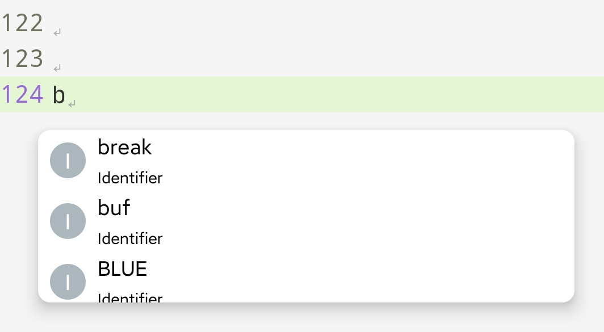
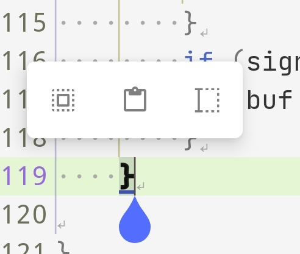
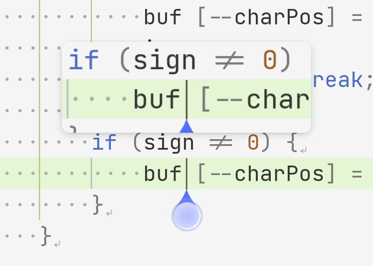
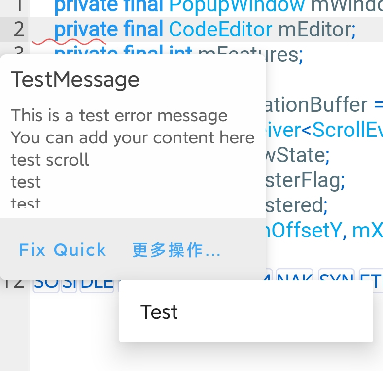

# 事件和组件

## Event事件

`Event`用于通知编辑器中的某些变化。由于编辑器会覆盖某些输入处理逻辑，所以请确保您使用的是编辑器的事件系统，而不是`View`的监听器。如果您使用这些监听器，则可能不会收到回调。

### 事件类型

常用：
* `ClickEvent`：执行单击时触发
* `DoubleClickEvent`：在用户双击视图时触发。此时首次单击会触发`ClickEvent`，第二次单击则不会。
* `LongPressEvent`：长按视图时触发。
* `ContentChangeEvent`：在调用`setText()`或编辑器中的当前文本发生更改时触发。

::: details 所有类型的事件
* ClickEvent
* DoubleClickEvent
* LongPressEvent
* ContentChangeEvent
* EditorKeyEvent
* KeyBindingEvent
* ScrollEvent
* SelectionChangeEvent
* SideIconClickEvent
* SnippetEvent
* HandleStateChangeEvent
* ColorSchemeUpdateEvent
* PublishSearchResultEvent
* EditorLanguageChangeEvent
* EditorFormatEvent
* EditorReleaseEvent
* ImePrivateCommandEvent
* BuildEditorInfoEvent
* EditorFocusChangeEvent
* EditorAttachStateChangeEvent
* ContextClickEvent
* HoverEvent
* CreateContextMenuEvent
:::

### 订阅事件

通常，我们使用`CodeEditor#subscribeEvent`为某些类型的事件添加回调。

下面是一个订阅`ClickEvent`的示例。

::: code-group

```Kotlin Kotlin
editor.subscribeEvent<ClickEvent> { event, unsubscribe ->
    // 执行内容
}
```

```Java Java
editor.subscribeEvent(ClickEvent.class, (event, unsubscribe) -> {
    // 执行内容
});
```
:::

如果您后续不打算在事件处理逻辑中取消订阅：

::: code-group

```Kotlin Kotlin
editor.subscribeAlways<ClickEvent> { event ->
    // 执行内容
}

// 或者
editor.subscribeAlways<ClickEvent> {
    // 执行内容
}
```

```Java Java
editor.subscribeAlways(ClickEvent.class, (event) -> {
    // 执行内容
});
```
:::

::: tip 注意
目前，您无法订阅抽象/超类的事件来处理具有相同超类的多种类型的事件。
:::

### 取消订阅事件

有时，我们不希望总是收到事件。您可以使用事件中给出的`Unsubscribe`对象自行取消订阅。

在下面的代码示例中，监听器将接收一次订阅事件。

::: code-group

```Kotlin Kotlin
editor.subscribeEvent<ClickEvent> { event, unsubscribe ->
    // 执行内容
    // ...
    unsubsribe.unsubscribe()
}
```
```Java Java
editor.subscribeEvent(ClickEvent.class, (event, unsubscribe) -> {
    // 执行内容
    // ...
    unsubscribe.unsubscribe();
});
```

:::

如果您想在事件回调之外取消订阅事件接收器，请使用您从`subscribeEvent`获得的对象。

::: code-group

```Kotlin Kotlin
val receipt = editor.subscribeEvent<ClickEvent> { event, unsubscribe ->
    // 执行内容
}
// 可以在任意位置取消订阅
receipt.unsubscribe()
```

```Java Java
var receipt = editor.subscribeEvent(ClickEvent.class, (event, unsubscribe) -> {
    // 执行内容
});
// 可以在任意位置取消订阅
receipt.unsubscribe();
```

:::

::: warning 请注意
`receipt`用于在回调之外取消订阅事件。如果您正在处理事件，请使用给定的`Unsubscribe`对象。
:::

## 组件

组件是编辑器的一部分。大多数组件都依赖于事件系统，编辑器本身并不直接控制组件。它们可以随时被禁用或替换。

### 组件操作

您可以通过`CodeEditor#getComponent`获取组件对象。

::: code-group
```Kotlin Kotlin
val component = editor.getComponent<EditorAutoCompletion>()
```
```Java Java
var component = editor.getComponent(EditorAutoCompletion.class);
```
:::

禁用组件。

::: code-group
```Kotlin Kotlin
component.enabled = false
```
```Java Java
component.setEnabled(false);
```
:::

### 组件介绍

#### 自动补全

`EditorAutoCompletion`管理自动完成分析和补全候选窗口。

它检查是否适合在编辑器事件上显示完成，并将后台完成任务调度给`Language`。

<div align="center"></div>

#### 文本操作窗口

`EditorTextActionWindow`管理文本操作的小面板，包括粘贴、复制、剪切、全选和长选。

当选择文本或用户单击插入选择时，将显示该面板。

<div align="center"></div>

#### 放大镜

`Magnifier`由`EditorTouchEventHandler`控制。按住任何选择手柄时，将显示文本放大镜。

<div align="center"></div>

#### 诊断工具提示

在进入诊断项目区域时，`EditorDiagnosticsTooltipWindow`将插入或选择文本时显示。它需要从您的Language实现中的`DiagnosticDetail`来获取诊断项目的详细信息。

工具提示窗口还允许用户对文本执行快速修复。（实验性）


<div align="center"></div>

#### 上下文菜单

`EditorContextMenuCreator`帮助编辑器能够让用户在编辑器中执行鼠标右键单击时创建上下文菜单。